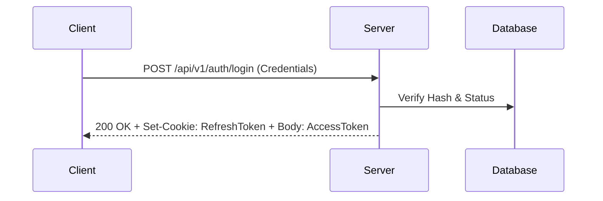
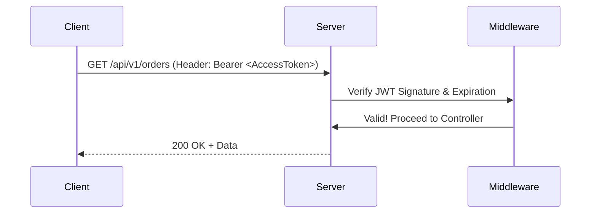
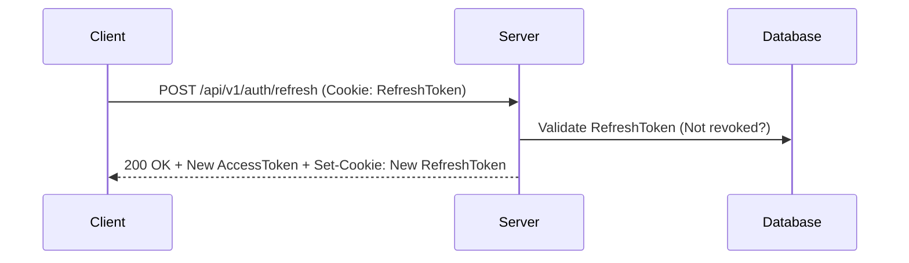

# Authentication & Authorization Flow

> Comprehensive guide to Vedashi's secure, role-based JWT authentication system.

Our authentication infrastructure is designed to securely support three distinct user types: **Customers**, **Vendors (Suppliers)**, and **Internal Admins**, while maintaining strict separation of concerns.

## Authentication Strategy

Vedashi utilizes **Stateless JWT (JSON Web Tokens)** paired with a secure **Refresh Token** mechanism.

### Token Architecture

1. **Access Token (`JWT`)**: 
   - **Lifespan**: Short-lived (e.g., 15 minutes).
   - **Storage**: Memory or `httpOnly` secure cookies (to prevent XSS).
   - **Payload**: Contains essential, non-sensitive identity claims (User ID, Role, Permissions).

2. **Refresh Token**:
   - **Lifespan**: Long-lived (e.g., 7 days).
   - **Storage**: `httpOnly`, `Secure`, `SameSite=Strict` cookies.
   - **Tracking**: Stored in the database (`customer_sessions` or `auth_sessions` table) to allow for remote revocation.

---

## Role-Based Access Control (RBAC)

We implement strict RBAC enforced at the API gateway and middleware level.

### 1. Customer Flow (`ROLE: CUSTOMER`)
- **Focus**: Seamless checkout, profile management, order history.
- **Features**: OTP login, Social SSO (Google, Apple), Magic Links.
- **Scope**: Can only access endpoints related to their own `customer_id`.

### 2. Vendor Flow (`ROLE: VENDOR`)
- **Focus**: Catalog management, order fulfillment, payout tracking.
- **Features**: 2FA enforced, strict scoping to `supplier_id`.
- **Scope**: Middleware automatically injects `supplier_id` into all queries to ensure a vendor can never view or modify another vendor's data (Tenant Isolation).

### 3. Admin Flow (`ROLE: ADMIN`, `ROLE: SUPER_ADMIN`)
- **Focus**: Platform oversight, vendor approval, global configurations.
- **Features**: IP whitelisting, mandatory hardware 2FA, detailed audit logging (`admin_audit_logs`).
- **Scope**: Full system access, scoped by specific granular permissions (e.g., `can_refund_orders`, `can_suspend_vendors`).

---

## The Authentication Lifecycle

### 1. Login

### 2. Accessing Protected Routes

### 3. Token Rotation (Refresh)
When the Access Token expires, the client silently requests a new one using the HTTP-only Refresh Token cookie.

---

## Security Best Practices Implemented

- **Token Blacklisting**: When a user logs out, their current refresh token is blacklisted in the database.
- **Password Hashing**: We use `Argon2id` or `Bcrypt` with high work factors.
- **Rate Limiting**: Brute-force protection on all `/auth/*` endpoints using Redis.
- **Token Versioning**: The database stores a `token_version` integer. If a user's account is compromised, we increment the `token_version` in the DB, instantly invalidating all issued JWTs that carry the old version in their payload.
