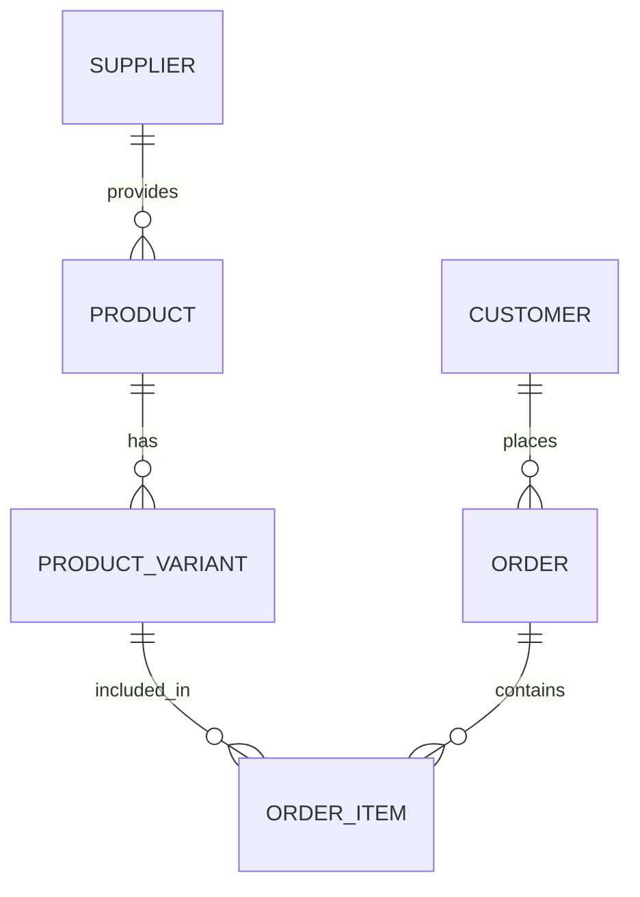

# Database Architecture

> Technical blueprints for Vedashi's highly scalable, multi-vendor relational database schema.

Our database is built on **PostgreSQL**, optimized for complex multi-party relationships, high-throughput inventory tracking, and robust transactional integrity. This document outlines our core schema paradigms.

## Core Domains

Our schema is logically partitioned into the following domains:

1. **Identity & Access Management (IAM):** Users, Roles, Permissions.
2. **Catalog & Inventory:** Products, Categories, Variants, Stock Movements.
3. **Vendor Management:** Suppliers, Storefronts, Payout Configs.
4. **Order Management:** Orders, Order Items, Shipments, Returns.

---

## Multi-Vendor Relationships

The Vedashi platform supports a true multi-vendor marketplace model. 

### Entity Diagram (Simplified)



### Key Tables

- **`suppliers`**: Acts as the root tenant for vendors. Each supplier has their own isolated catalog and financial settings.
- **`products`**: Base product definitions tied to a specific `supplier_id`.
- **`product_variants`**: Handles SKUs, pricing, and specific attributes. This enables a supplier to offer multiple variations of a base product without data duplication.

---

## Inventory Tracking System

To prevent race conditions and overselling during high-traffic events, we employ a **Stock Movement** architecture.

### The Problem with Simple Decrements
A naive `UPDATE product_variants SET stock = stock - 1` can lead to deadlocks and race conditions.

### The Vedashi Solution
We use an append-only `stock_movements` table to track every change in inventory, ensuring absolute auditability.

```sql
CREATE TABLE stock_movements (
    id UUID PRIMARY KEY,
    variant_id UUID REFERENCES product_variants(id),
    quantity_change INTEGER NOT NULL, -- e.g., -1 for sale, +10 for restock
    reason VARCHAR(50) NOT NULL, -- 'SALE', 'RESTOCK', 'RETURN', 'ADJUSTMENT'
    reference_id UUID, -- Links to order_id or return_id
    created_at TIMESTAMP DEFAULT NOW()
);
```

**Real-time Stock Calculation:** Current stock is an indexed materialization of the sum of `stock_movements` for a given variant, periodically compacted to ensure query speed.

---

## Concurrency & Transactions

All critical financial and inventory operations are wrapped in `SERIALIZABLE` or strictly locked transactions to ensure ACID compliance.

- **Order Placement:** Uses `SELECT ... FOR UPDATE` on inventory records to lock rows during checkout validation.
- **Snapshots:** `order_items` stores historical snapshots (`unit_price`, `product_name_snapshot`) to ensure that post-purchase changes by a vendor do not alter historical order invoices.

## Optimization & Indexing

- **Foreign Keys:** All foreign keys are indexed by default.
- **Full-Text Search:** We utilize PostgreSQL's `tsvector` and GIN indexes on `products.search_vector` for lightning-fast catalog queries.
- **JSONB:** Used sparingly for unstructured data (e.g., dynamic product specifications, external API payloads) and heavily indexed using GIN paths.
