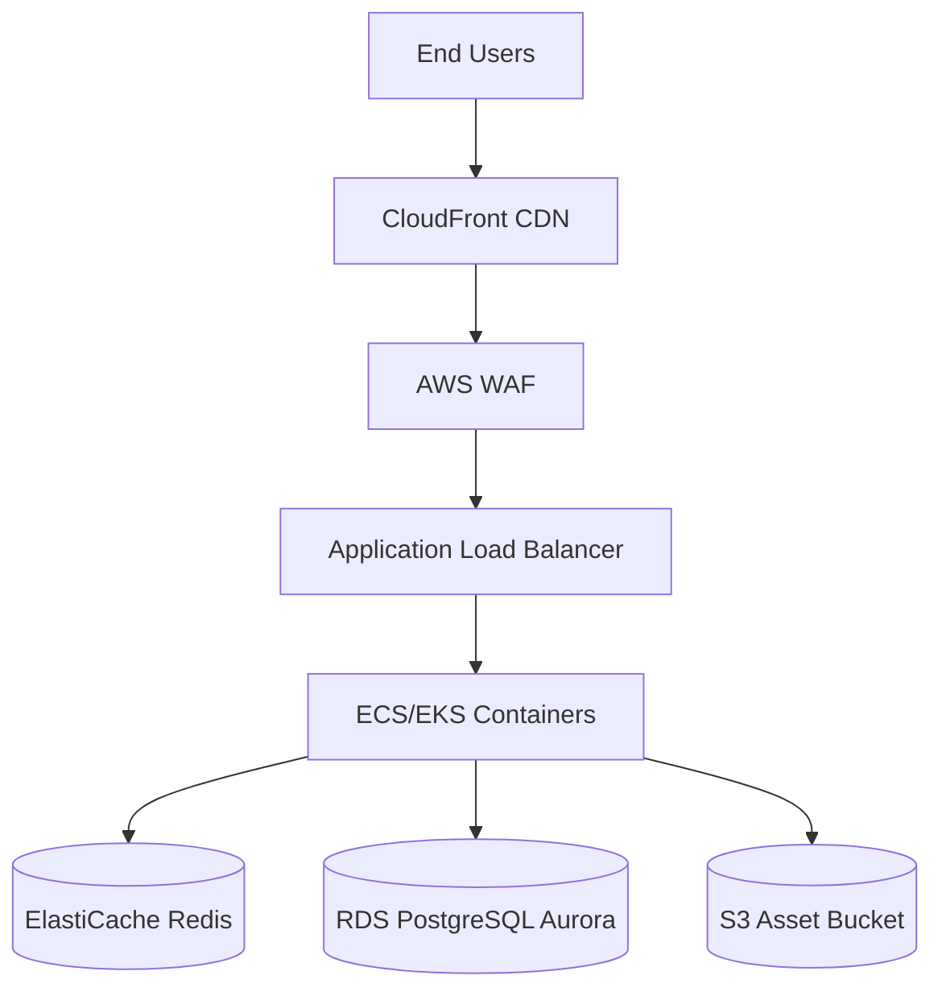

# Infrastructure & Deployment

> AWS CloudFormation templates, CDN caching strategies, and DevOps pipelines for Vedashi.

Vedashi is designed to be highly available, fault-tolerant, and infinitely scalable to handle sudden traffic spikes (e.g., flash sales, holiday traffic). Our infrastructure is defined as code (IaC) using **AWS CloudFormation / Terraform**.

## High-Level Architecture

Our stack leverages modern cloud-native principles:

### Core Components

1. **Compute Layer:** Node.js backend running in Docker containers, orchestrated by **Amazon ECS (Fargate)**. Auto-scaling policies are triggered based on CPU utilization and request count.
2. **Database Layer:** **Amazon Aurora PostgreSQL (Serverless v2)** for high-availability, automatic scaling, and automated backups with point-in-time recovery.
3. **Caching Layer:** **Amazon ElastiCache (Redis)** handles session storage, rate limiting, and caching of heavy catalog queries.
4. **Storage:** **Amazon S3** for all vendor uploads, product images, and static assets.

---

## CDN & Caching Strategy (CloudFront)

Global performance is critical for e-commerce. We utilize **Amazon CloudFront** to edge-cache our content globally.

### Caching Tiers

- **Tier 1: Static Assets (Images, CSS, JS)**
  - `Cache-Control: public, max-age=31536000, immutable`
  - Served directly from CloudFront edge locations. 100% cache hit rate target.
  
- **Tier 2: Public API Endpoints (Catalog, Categories)**
  - E.g., `/api/v1/products`
  - Short-lived TTLs (e.g., 5-15 minutes). 
  - We utilize Redis internally, but CloudFront adds an edge layer for non-authenticated traffic.
  
- **Tier 3: Private / Dynamic API Endpoints (Cart, Checkout, User Profile)**
  - `Cache-Control: no-cache, no-store, must-revalidate`
  - Bypasses CloudFront caching entirely and routes directly to the ALB.

### Image Optimization
We use CloudFront integration with AWS Lambda@Edge (or a dedicated service) to serve WebP/AVIF formats dynamically based on the `Accept` header of the requesting browser.

---

## CI/CD Pipeline

Our deployment lifecycle is fully automated via **GitHub Actions**.

1. **Lint & Test:** On PR to `main`, Jest unit and integration tests are run.
2. **Build:** If tests pass, a Docker image is built and pushed to **Amazon ECR**.
3. **Deploy (Staging):** The image is deployed to a staging ECS cluster. Automated E2E Cypress tests run.
4. **Deploy (Production):** Upon manual approval, CloudFormation updates the production ECS service, orchestrating a **Rolling Update** with zero downtime.

## Security & Compliance

- **AWS WAF:** Protects against SQL injection, XSS, and massive DDoS attacks.
- **VPC:** All databases (RDS, Redis) reside in private subnets, completely isolated from the public internet. Only the ALB is exposed via public subnets.
- **Secrets Management:** AWS Secrets Manager injects database credentials and API keys directly into ECS containers at runtime. No secrets are stored in the codebase or environment variables files.
