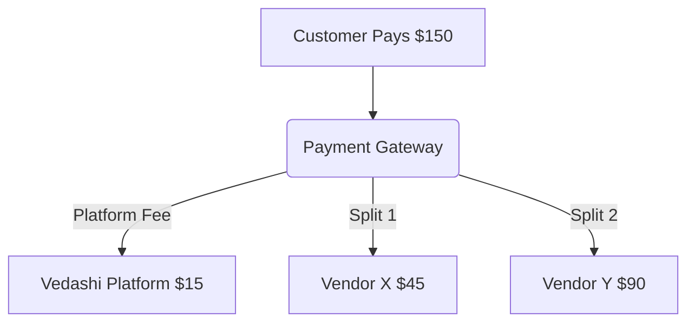

# 💸 Payment Splits & Financial Routing

> Logic documentation for handling multi-party transactions, commissions, and automated vendor payouts.

In a multi-vendor marketplace, payment logic is highly complex. A single customer checkout may contain products from three different vendors. Vedashi handles this seamlessly by utilizing payment gateways that support multi-party routing (e.g., **Stripe Connect** or **Razorpay Route**).

## 🧩 The Challenge: Unified Checkout

When a customer checks out, they expect a single transaction, regardless of how many vendors they are buying from.

**Scenario:**
- Customer Cart Total: $150
- Item A (Vendor X): $50
- Item B (Vendor Y): $100
- Platform Commission: 10%

## 🛤️ The Routing Architecture

We do not hold funds manually. Instead, we use programmatic splits at the time of charge.

### The Flow

1. **Order Generation:** The cart is split logically in the database into sub-orders, one per vendor.
2. **Payment Intent Creation:** We create a single Payment Intent for $150.
3. **Transfer Definition:** We define the payload for the gateway, specifying the splits:
   - Transfer $45 to Vendor X's connected account ($50 - 10%).
   - Transfer $90 to Vendor Y's connected account ($100 - 10%).
   - The remaining $15 automatically stays in the Platform's main account as revenue.

---

## ⏳ Holding Funds & Fulfillment

To ensure buyer protection and prevent fraud, vendor payouts are not immediate.

1. **Authorized & Held:** When the customer pays, funds are captured but placed in a "Pending" balance on the vendor's connected account.
2. **Fulfillment Trigger:** The vendor ships the item.
3. **Delivery Trigger:** The customer receives the item. A 7-day return window begins.
4. **Release (Payout):** Once the return window expires without dispute, our cron job triggers an API call to the payment gateway to release the funds to the vendor's actual bank account.

---

## 🧮 Handling Refunds & Disputes

Refunds are complex because the platform fee and the vendor's portion must both be reversed.

- **Full Refund:** The platform reverses the entire transaction. The gateway automatically pulls $45 from Vendor X, $90 from Vendor Y, and $15 from the Platform.
- **Partial Refund (e.g., returning only Item A):** The system calculates the exact transfer reversal needed. It pulls $45 back from Vendor X and $5 back from the Platform. Vendor Y is unaffected.

## 📊 Ledger & Reconciliation

Our `wallet_transactions` and `invoices` tables maintain an immutable ledger.
- Every split, fee, tax calculation, and payout is recorded as a double-entry accounting ledger entry.
- Monthly reconciliation scripts cross-reference our internal ledger with the Payment Gateway's settlement reports to flag any discrepancies automatically.
